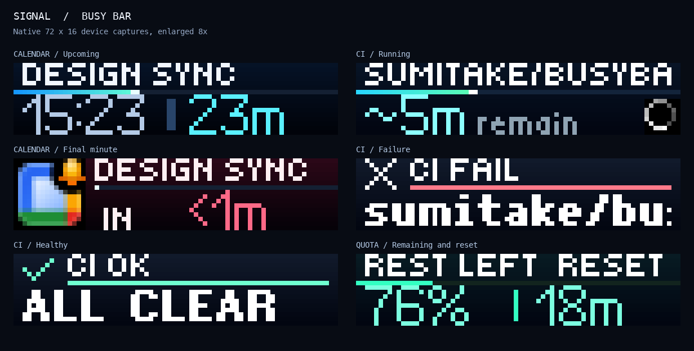
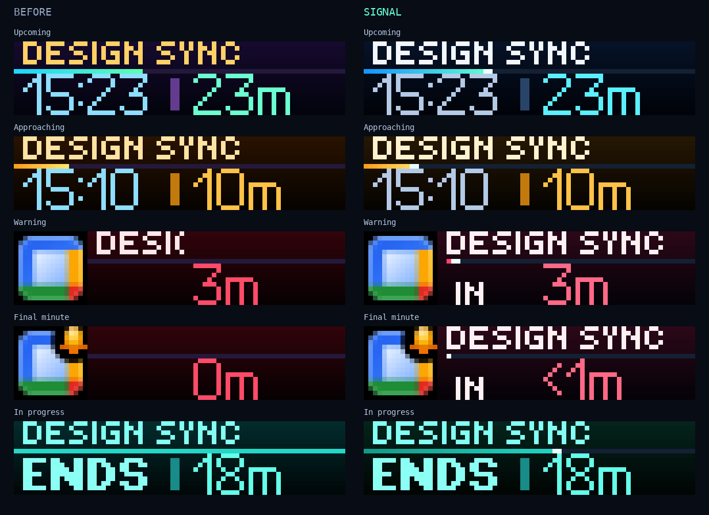
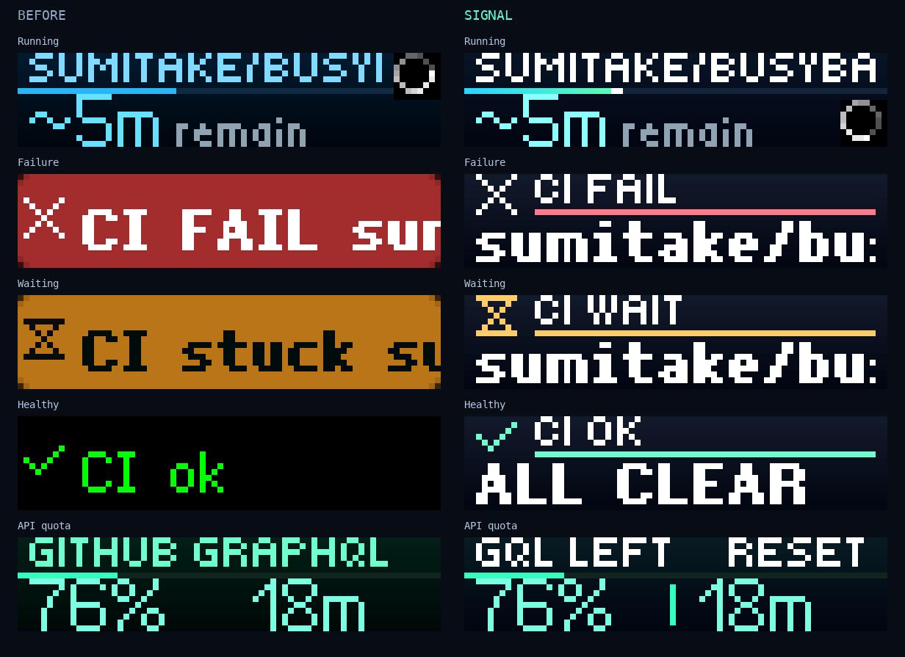
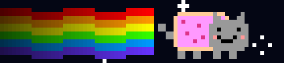

# Signal display design

Signal gives the calendar, CI status, and idle animation a shared visual style:
dark navy backgrounds, bright numerals, thin progress tracks, and native motion.
Cyan signals activity, amber approaching or waiting, coral urgency or failure,
and mint an active event or healthy CI. Text labels keep each state identifiable
without relying on color alone.

These are native **72×16 framebuffer captures**, enlarged with nearest-neighbor
scaling. They use fixed demonstration events and runs, not live calendar content.
The screenshots show the start of scrolling titles; the full text remains in
the device payload. LED brightness and diffusion can look different in person.

## Calendar flow

The familiar sequence stays intact: upcoming → approaching → warning → imminent
→ start animation → in progress. The redesign makes that sequence easier to read:

- The large start time and countdown retain their existing size and positions.
- Warning and imminent screens reserve a 16-pixel lane for the animated calendar
  icon and a **52-pixel title lane**. The title remains visible through the final
  minute, with `IN <1m` below it.
- A bright endpoint makes the progress track easier to locate. Upcoming tracks
  drain toward the start; active-event tracks now drain against the event's
  duration, alongside the existing `ENDS` countdown.
- The existing full-screen start animation still provides the transition into
  an active event.

## CI flow

Failure, waiting, and healthy cards share a fixed heading and a bold lower row.
`CI FAIL`, `CI WAIT`, and `CI OK` stay visible while repository, ref, and workflow
details scroll. The healthy state uses the compact, static `ALL CLEAR` label.
Firmware 1.2.3 adds a small status icon beside the heading; the words remain
readable when icons are disabled or unavailable over an older/cloud route.

Running builds retain their large ETA. Moving the native spinner to the
lower-right corner gives the title its full width, while a separate text budget
keeps ETA labels clear of the spinner. The progress track uses a cyan-to-mint
gradient with a bright endpoint.

Quota screens label the left value `GQL LEFT` or `REST LEFT`, and the right
value `RESET`, with a thin separator. Their percentages and reset countdowns
keep the existing meaning.

## Idle animation

Nyan keeps its recognizable silhouette and 12 fps motion, with a navy backdrop,
a rainbow that fades toward the tail, and a star pattern that repeats seamlessly
over the 24-frame loop. The device plays the uploaded animation as before.

The GIF is an enlarged preview generated from the committed source frames,
not a recording of the physical display. The encoded `.anim` was also uploaded
under a separate preview application and successfully drawn by the device.

## Behavior and validation

This is a presentation change. Event selection, escalation thresholds,
integration priorities, CI rotation and dwell times, poll intervals, frame
timeouts, quiet hours, and manual-session precedence retain their existing
contracts. New shapes use the same cleanup and expiring-frame paths. Motion
runs on the device; no host animation loop, service, dependency, or new
configuration is introduced.

Validation on firmware **1.2.3 / API 27.5.0** included native captures of five
calendar states, running/failure/waiting/healthy CI, both quota labels, and an
encoded Nyan asset draw. The final-minute `<` glyph, `ALL CLEAR`, and `REST LEFT`
were checked on the native framebuffer. Temporary preview frames used their
own application name, priority below manual sessions, a five-second timeout,
and application-scoped cleanup. Production jobs were not restarted for these
previews.

The automated suite passes **445 tests**, covering existing selection and
handoff behavior plus title retention, track bounds, spinner separation, CI log
context, and deterministic animation generation. All 24 PNG frames and the
encoded animation were independently regenerated and matched byte for byte.
